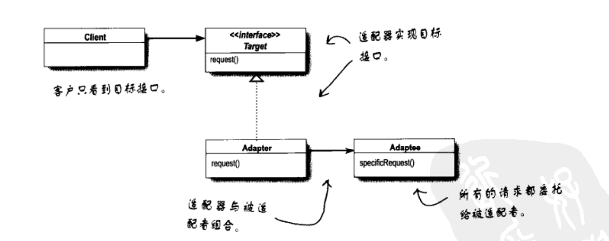
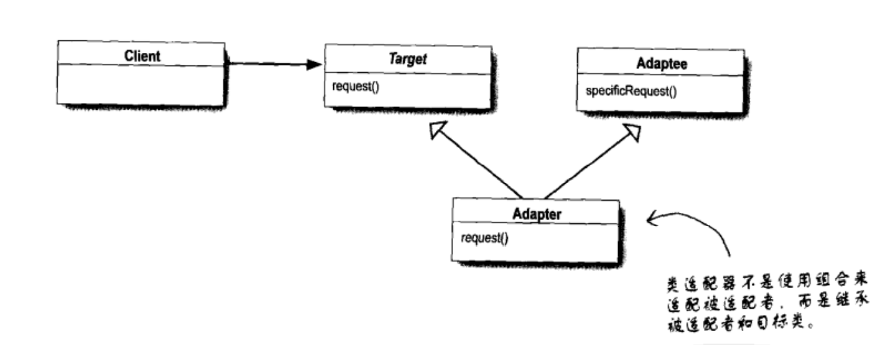
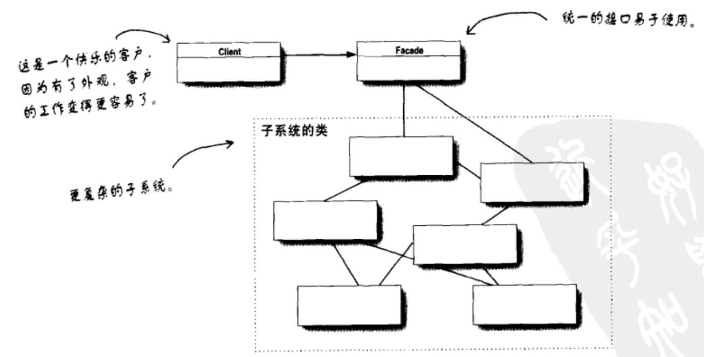

# 适配器模式与外观模式
适配器模式将一个类的接口，转换成客户期望的另一个接口。适配器让原本接口不兼容的类可以合作。

在软件开发的过程中，有时为了完成一项较为复杂的功能，一个类需要和多个其他业务类交互，而这些需要交互的业务经常会作为一个完整的整体出现，由于涉及的类比较多，导致使用时代码较为复杂。因此，需要一个类似服务员的角色，来负责与多个业务类进行交互，而使用这些业务类的类只需和该类交互即可。
外观模式提供了一个统一的接口，用来访问子系统中的一群接口。外观定义了一个高层接口，让子系统更容易使用。

## UML

### 对象适配器模式

### 类适配器模式

### 外观模式
