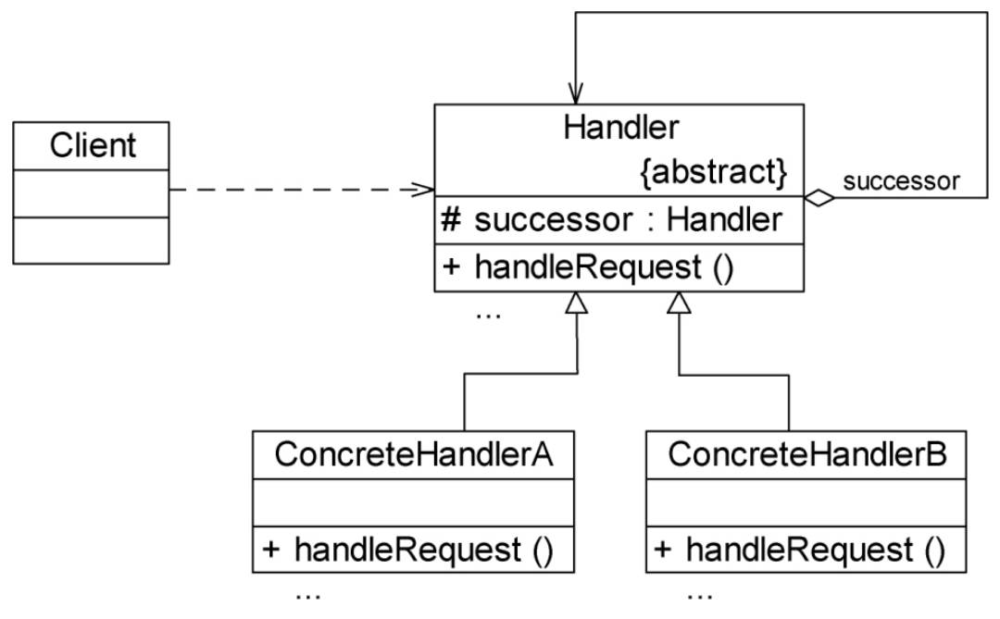

# 职责链模式
避免将请求发送者和接收者耦合在一起，让多个对象都有机会接受请求，将这些对象连接成一条链，并且沿着这条链传递请求，直到有对象处理它为止。

## UML
### 职责链模式

## 分类
- 纯的职责链模式：一个具体的矗立着对象只能在两个行为中选择：要么承担全部责任，要么将责任推给下家。不逊于出现某一个具体处理者对象在承担一部分或全部责任之后将责任向下传递的情况。不能出现某个请求未被任何一个处理者对象处理的情况。

- 不纯的职责链模式：允许某个请求被一个具体处理者部分处理后再向下传递，或者一个具体处理者处理完某请求后其后继处理者可以继续处理该请求。一个请求最终可以不被任何处理者对象接受。
