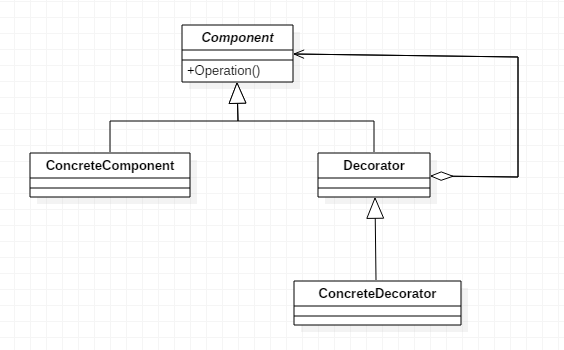

# 装饰器模式
动态地将责任附加到对象上, 若要扩展功能, 装饰器提供了比继承更有弹性的替代方案。

## UML


## 实例
```cpp
// 咖啡店的例子
class Beverage {
public:
	Beverage(string description = "") : description(description) {}

	const string& getDescription() { return description; }

	virtual double cost() = 0;

protected:
	string description;
};

// 装饰器（调料）
class CondimentDecorator : public Beverage {
public:
	CondimentDecorator(string description = "") : Beverage(description) {}
};

// Espresso 是一种饮料
class Espresso : public Beverage {
public:
	Espresso() : Beverage("Espresso") {}

	virtual double cost() override {
		return 9.9;
	}
};

// 摩卡是一种调料
class Mocha : public CondimentDecorator {
public:
	Mocha(Beverage* beverage) : beverage(beverage), CondimentDecorator(beverage->getDescription() + ", Mocha") {}

	virtual double cost() override {
		return 0.2 + beverage->cost();
	}
private:
	Beverage* beverage;
};
```