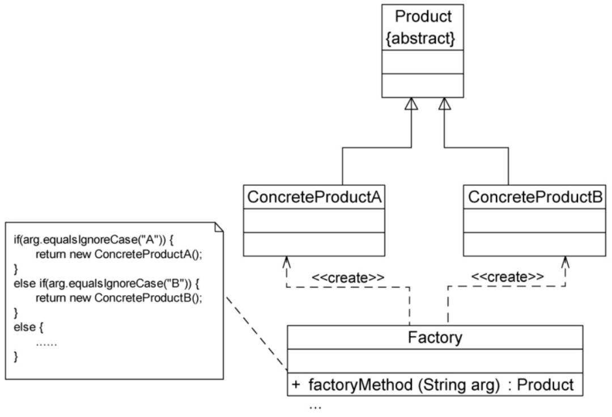
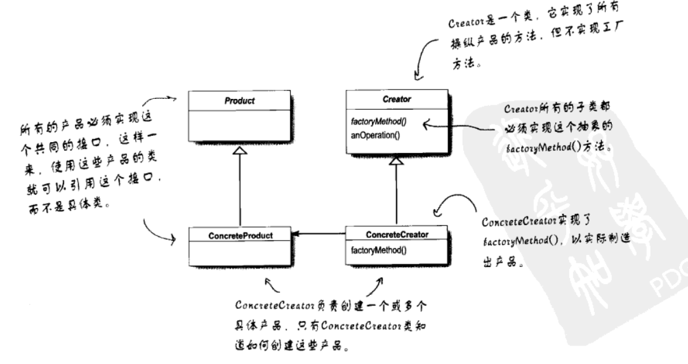
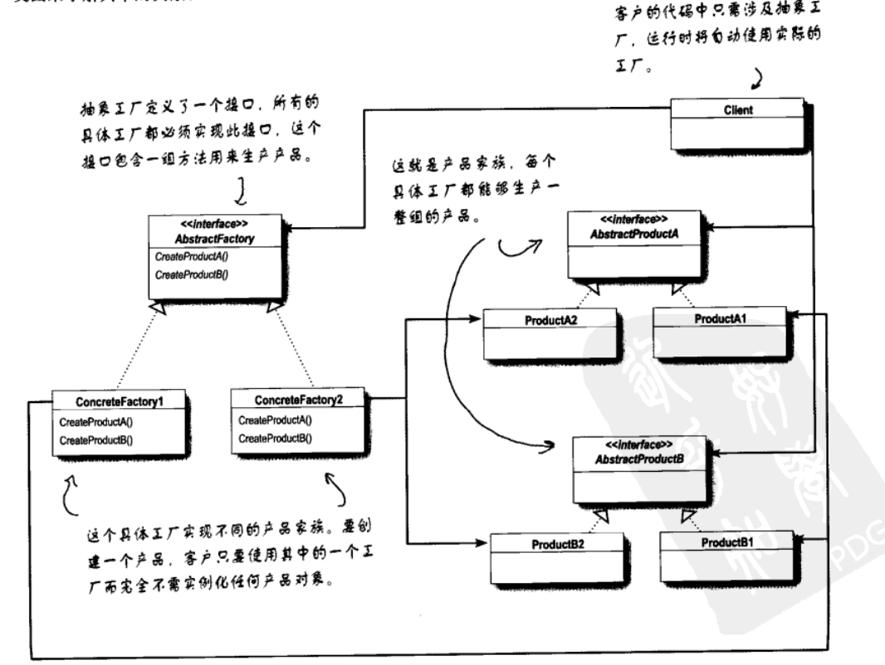

# 工厂模式

## 简单工厂模式
定义一个工厂类，它可以根据参数的不同返回不同类的实例，被创建的实例通常都具有共同的父类。

## 工厂方法模式
当系统中需要引入新的对象时，由于静态工厂方法通过所传入的参数来创建不同的产品，必定要修改工厂类的源代码，违背开闭原则。使用工厂方法模式来实现增加新的方法而不影响已有代码。

在工厂方法模式中，不再提供一个统一的工厂类来创建所有的对象，而是针对不同对象提供不同的工厂。
所有工厂模式都用来封装对象的创建。工厂方法模式通过让子类决定该创建的对象是什么，来达到将对象创建过程封装的目的。

工厂方法模式：工厂方法模式定义了一个创建对象的接口，但由子类决定要实例化的类是哪一个。工厂方法将类的实例化延迟到子类。

## 抽象工厂模式
由于工厂方法模式每个工厂只生产一类产品，可能会导致系统中存在大量的工厂类，增加系统开销。可以考虑将一些相关的产品组成一些“产品族”，由同一个工厂来生产。

抽象工厂模式：抽象工厂模式定义一个接口，用于创建相关或依赖对象的家族，而不需要明确指定具体类。

## UML

### 简单工厂

### 工厂方法

### 抽象工厂

