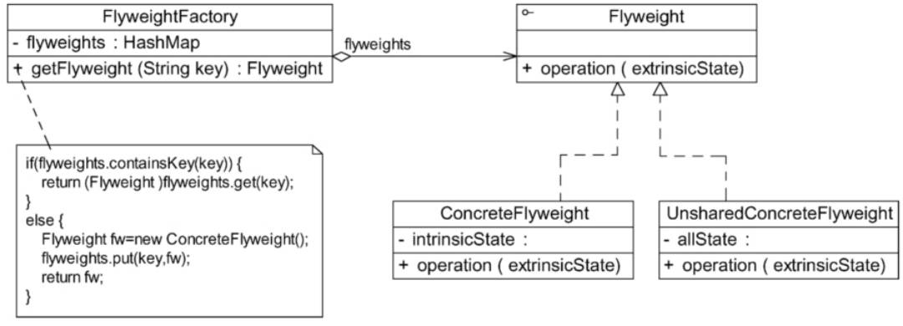

# 享元模式
当一个软件在运行时产生的对象数目太多，将导致运行代价过高，带来系统性能下降的问题。享元模式通过共享技术实现相同或相似的对象的重用。

享元模式：运用共享技术有效地支持大量细粒度对象的复用。系统只使用少量的对象，而这些对象都很相似，状态变化很小，可以实现对象的多次复用。 

## UML

### 享元模式

- **Flyweight（抽象享元类）**：通常是一个接口或抽象类，其中包含了向外界提供享元对象的内部数据的方法，以及可以通过这些方法设置的外部数据。

- **ConcreteFlyweight（具体享元类）**：实现抽象享元类，其实例被称为享元对象。

- **UnsharedConcreteFlyweight（非共享具体享元类）**：并不是所有的享元类都需要被共享，不能被共享的子类可设计为非共享具体享元类。

- **FlyweightFactory（享元工厂类）**：用于创建并管理享元对象。 