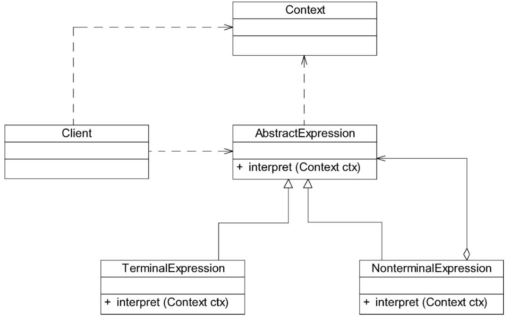

# 解释器模式
解释器模式用于描述如何使用面向对象语言构建一个简单的语言解释器。
解释器模式：定义一个语言的文法，并且建立一个解释器来解释该语言中的句子。

## UML
### 解释器模式

- **TerminalExpression**：终结符表达式

- **NonterminalExpression**： 非终结符表达式

- **Context**：用户存储解释器之外的一些全局信息