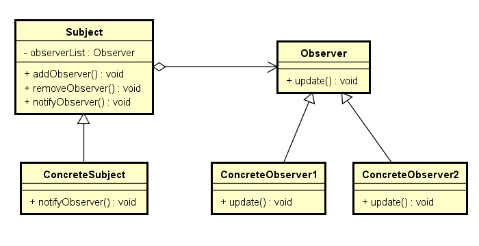

# 观察者模式
定义了对象之间的一对多依赖, 当一个对象状态发生改变时, 它的所有依赖对象都会收到通知并自动更新

## 作用
帮助对象知悉现状, 不会错过对象感兴趣的事, 并在运行时决定是否继续被通知。

## UML
### 观察者模式


## 实例
```cpp
// 定义接口
class Observer {
public:
	virtual void update(int arg) = 0;
	virtual ~Observer() = 0;
};

class Subject {
public:
	virtual void addObserver(Observer*) = 0;
	virtual void removeObserver(Observer*) = 0;
	virtual void notifyObservers() = 0;
	virtual ~Subject() = 0;
};

// 实现
class ConcreteObserver : public Observer {
public:
	virtual void update(int arg) {
		cout << arg << endl;
	}
};

class ConcreteSubject : public Subject {
public:
	virtual void addObserver(Observer* observer) override {
		observers.push_back(observer);
	}

	virtual void removeObserver(Observer* observer) override {
		auto pos = find(observers.begin(), observers.end(), observer);
		if (pos != observers.end()) {
			observers.erase(pos);
		}
	}

	virtual void notifyObservers() override {
		for (auto observer : observers) {
			observer->update(0);
		}
	}

private:
	vector<Observer*> observers;
};
```