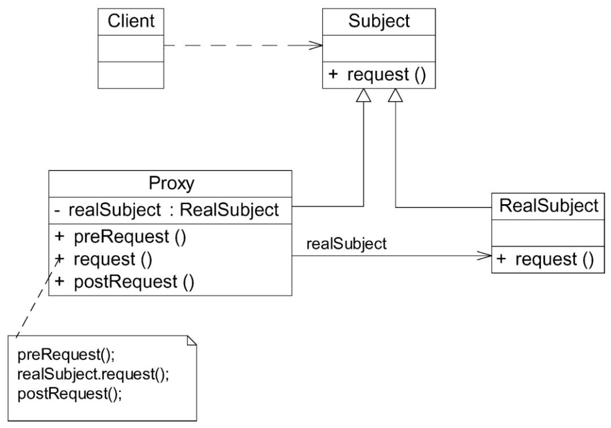

# 代理模式

给一个对象提供一个代理，并由代理对象控制对原对象的引用。

## UML
### 代理模式

- Subject： 真实主题和代理主题的共同接口

- Proxy：代理主题角色内部包含了对真实主题的引用，可以操作真实主题对象。在代理主题角色中提供一个与真实主题角色相同的接口，以便在任何时候都可以代替真实主题。

- RealSubject：定义代理角色所代表的真实对象。

## 常用的代理模式
### 远程代理
为一个位于不同地址空间的对象提供一个本地的代理对象，这个不同的地址空间可以在同一台主机中，也可以在另一台主机中。

### 虚拟代理
如果需要创建一个资源消耗较大的对象，先创建一个消耗较小的对象进行表示，真实对象只在需要时才进行创建。

### 保护代理
控制一个对象的访问。

### 缓冲代理
为某一个目标操作的结果提供临时存储空间。

### 智能引用代理
当一个对象被引用时，提供一些额外的操作。