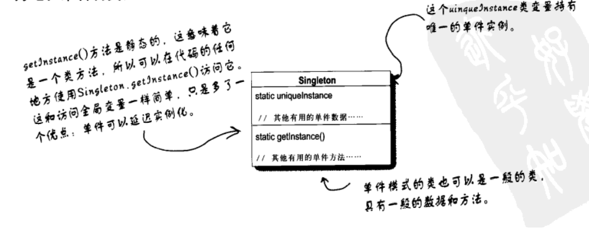

# 单例模式
单例模式确保类只有一个实例，并提供一个全局访问点。

## UML

### 单例模式


## 实例

### 定义时直接实例化
```cpp
class Singleton {
public:
	Singleton* getInstance() {
		return instance;
	}

private:
	static Singleton* instance;
};

Singleton* Singleton::instance = new Singleton;
```

### 双重检查锁模式
```cpp
class Singleton {
public:
	Singleton* getInstance() {
		if (instance == nullptr) {
			static mutex m;
			lock_guard guard(m);
			if (instance == nullptr) {
				instance = new Singleton;
			}
		}
		return instance;
	}

private:
	static Singleton* instance;
};

Singleton* Singleton::instance = nullptr;
```

### 静态局部变量
```cpp
class Singleton {
public:
	Singleton* getInstance() {
		static Singleton instance;
		return &instance;
	}
};
```