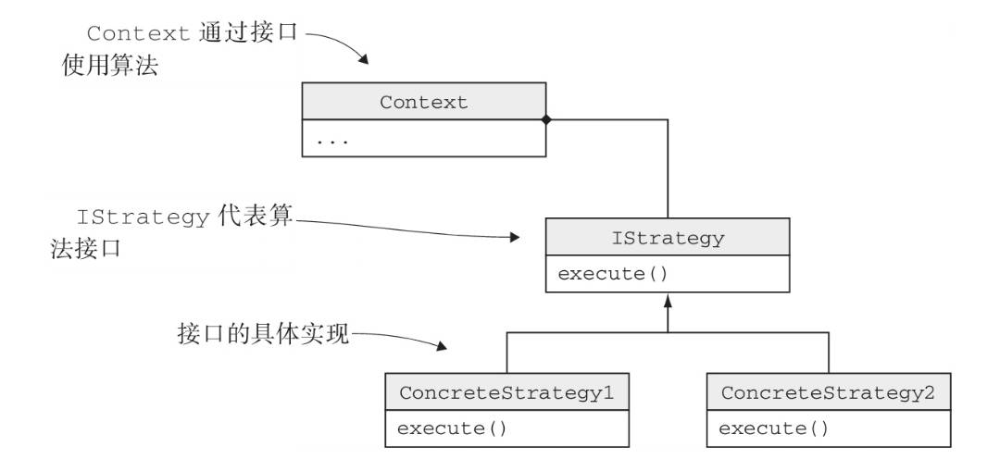
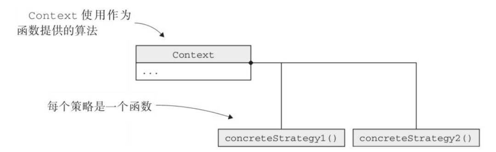

# 策略设计模式
策略模式定义了算法族，分别封装起来，让他们之间可以相互替换，使算法的变化独立于使用算法的客户。

## UML
### 策略模式 - 面向对象


### 策略模式 - 函数接口


## 实例
```cpp
// 定义接口
class FlyBehavior {
public:
	virtual void fly() = 0;
};

class Duck {
private:
	FlyBehavior* flyBehavior;

public:
	// 可变的部分拆分出来，将其委托给行为类
	virtual void performFly() {
		flyBehavior->fly();
	}

	// 不变的部分
	virtual void swim() {
		cout << "all duck can swim" << endl;
	}

	Duck(FlyBehavior* flyBehavior) : flyBehavior(flyBehavior) {}

	// 使用 set 更改行为
	void setFlyBehevior(FlyBehavior* flyBehavior) { this->flyBehavior = flyBehavior;  }
};

// 实现接口
class FlyWithWings : public FlyBehavior {
public:
	virtual void fly() override {
		cout << "FlyWithWings" << endl;
	}
};

class CannotFly : public FlyBehavior {
public:
	virtual void fly() override {
		cout << "CannotFly" << endl;
	}
};

int main()
{
	FlyBehavior* fly_with_wings = new FlyWithWings;
	Duck duck(fly_with_wings);
	duck.performFly();

	FlyBehavior* cannot_fly = new CannotFly;
	duck.setFlyBehevior(cannot_fly);
	duck.performFly();
}
```

## 简化
接口数目较少时，可以使用函数接口进行简化。

```cpp
class Duck {
public:
	using FlyBehavior = function<void()>;
    
private:
	FlyBehavior flyBehavior;

public:
	// 可变的部分拆分出来，将其委托给行为类
	virtual void performFly() {
		flyBehavior();
	}

	// 不变的部分
	virtual void swim() {
		cout << "all duck can swim" << endl;
	}

	Duck(FlyBehavior flyBehavior) : flyBehavior(flyBehavior) {}

	// 使用 set 更改行为
	void setFlyBehevior(FlyBehavior flyBehavior) { this->flyBehavior = flyBehavior;  }
};


int main()
{
	Duck duck([]() { cout << "FlyBehavior" << endl; });
	duck.performFly();
}
```
