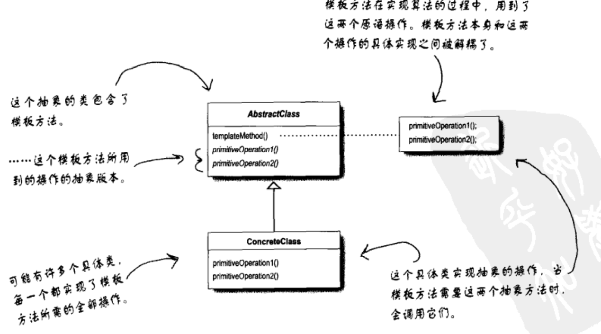

# 模板方法
模板方法模式在一个方法中定义一个算法的骨架，而将一些步骤延迟到子类中。模板方法使得子类可以在不改变算法结构的情况下，重新定义算法中的某些步骤。

## UML
### 模板方法


## 实例
```cpp
class AbstractClass {
public:
	void templateMethod() {
		primitiveOperation1();
		primitiveOperation2();
		concreteOperation();
		hook();
	}

	virtual void primitiveOperation1() = 0; // 子类实现

	virtual void primitiveOperation2() = 0;

	void concreteOperation() {}

	virtual void hook() {} // 子类视情况而定是否覆盖
};
```